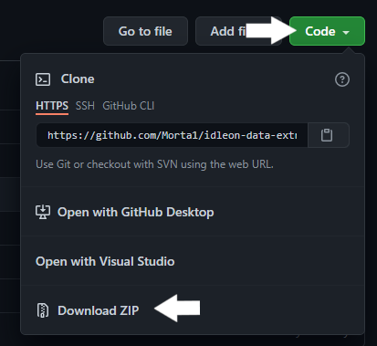
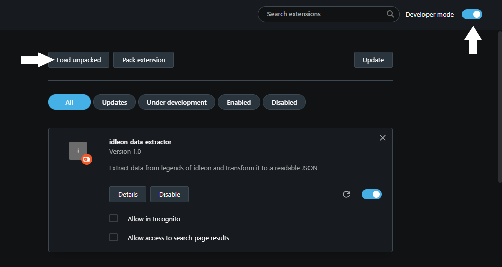

# idleon-data-extractor

A data extraction tool for Legends of Idleon.

A JSON object is extracted by the extension and is meant to be used in my site to help you track your idleon's family
progression along some more feature, you can check it out here
[Idleon Family Progression](https://morta1.github.io/IdleonToolbox/family).

## How to use

1. Download the content of the library
2. Extract the zip anywhere.
3. Go to chrome://extension (or opera://extensions in opera).
4. Make sure "Developer mode" is checked at the top right of the screen
5. Click "Load unpacked" and select the extracted folder.
6. Now you can go to [Idleon Family Progression](https://morta1.github.io/IdleonToolbox/family) and see your data!

## credits

[Corbeno](https://github.com/Corbeno) - for the inspiration for this extension.
